```mermaid
flowchart TD
    ROOT["🏛️ Laboratório de Operações de Tesouraria\nMBA em Bancos e Instituições Financeiras"]

    ROOT --> M1
    ROOT --> M2
    ROOT --> M3
    ROOT --> M4

    M1["🏦 Módulo 1\nOperações Fundamentais\nCaptação, Aplicação e Gestão de Caixa"]
    M2["📝 Módulo 2\nCurva de Juros (ETTJ)\nConstrução, Interpolação e Cenários"]
    M3["💰 Módulo 3\nPrecificação de Ativos\nTítulos Públicos, Bancários e Corporativos"]
    M4["🎯 Módulo 4\nGestão de Carregamento\nEstratégias, Duration e Imunização"]

    M1 --> M1a["🏦 Visão Geral do Módulo 1"]
    M1 --> M1b["📐 Matemática Financeira Aplicada"]
    M1 --> M1c["💰 Mercado Monetário e Taxas de Juros"]
    M1 --> M1d["🌐 Cenário Econômico e Taxa de Juros"]
    M1 --> M1e["⚠️ Risco Financeiro e Taxa de Juros"]
    M1 --> M1f["🧩 Exercício Integrador"]

    M2 --> M2a["🏦 Visão Geral do Módulo 2"]
    M2 --> M2b["🧩 Componentes da Taxa de Juros"]
    M2 --> M2c["📝 Estrutura Temporal (ETTJ)"]
    M2 --> M2d["🌐 Taxa Forward (FRA)"]
    M2 --> M2e["💱 Cupom Cambial"]
    M2 --> M2f["🎯 Exercício Integrador"]

    M3 --> M3a["🏦 Visão Geral do Módulo 3"]
    M3 --> M3b["🇧🇷 Títulos Públicos Federais"]
    M3 --> M3c["🏦 Títulos Privados de IFs"]
    M3 --> M3d["🏢 Títulos Privados de Empresas"]
    M3 --> M3e["⚖️ Exercício Integrador"]

    M4 --> M4a["🏦 Visão Geral do Módulo 4"]
    M4 --> M4b["📊 Estratégias de Investimento"]
    M4 --> M4c["⚠️ Risco de Taxa de Juros"]
    M4 --> M4d["📐 Duration e Convexidade"]
    M4 --> M4e["🛡️ Imunização"]
    M4 --> M4f["🎯 Exercício Integrador"]

    style ROOT fill:#1a2744,color:#fff,stroke:#1a2744
    style M1 fill:#2e5fa3,color:#fff,stroke:#2e5fa3
    style M2 fill:#1e7a5e,color:#fff,stroke:#1e7a5e
    style M3 fill:#b85c00,color:#fff,stroke:#b85c00
    style M4 fill:#7b2d8b,color:#fff,stroke:#7b2d8b

    style M1a fill:#dce8f7,color:#1a2744,stroke:#2e5fa3
    style M1b fill:#dce8f7,color:#1a2744,stroke:#2e5fa3
    style M1c fill:#dce8f7,color:#1a2744,stroke:#2e5fa3
    style M1d fill:#dce8f7,color:#1a2744,stroke:#2e5fa3
    style M1e fill:#dce8f7,color:#1a2744,stroke:#2e5fa3
    style M1f fill:#dce8f7,color:#1a2744,stroke:#2e5fa3

    style M2a fill:#d3efe6,color:#1a2744,stroke:#1e7a5e
    style M2b fill:#d3efe6,color:#1a2744,stroke:#1e7a5e
    style M2c fill:#d3efe6,color:#1a2744,stroke:#1e7a5e
    style M2d fill:#d3efe6,color:#1a2744,stroke:#1e7a5e
    style M2e fill:#d3efe6,color:#1a2744,stroke:#1e7a5e
    style M2f fill:#d3efe6,color:#1a2744,stroke:#1e7a5e

    style M3a fill:#fde8d0,color:#1a2744,stroke:#b85c00
    style M3b fill:#fde8d0,color:#1a2744,stroke:#b85c00
    style M3c fill:#fde8d0,color:#1a2744,stroke:#b85c00
    style M3d fill:#fde8d0,color:#1a2744,stroke:#b85c00
    style M3e fill:#fde8d0,color:#1a2744,stroke:#b85c00

    style M4a fill:#f2d9f7,color:#1a2744,stroke:#7b2d8b
    style M4b fill:#f2d9f7,color:#1a2744,stroke:#7b2d8b
    style M4c fill:#f2d9f7,color:#1a2744,stroke:#7b2d8b
    style M4d fill:#f2d9f7,color:#1a2744,stroke:#7b2d8b
    style M4e fill:#f2d9f7,color:#1a2744,stroke:#7b2d8b
    style M4f fill:#f2d9f7,color:#1a2744,stroke:#7b2d8b
```

# 🏛️ Laboratório de Operações de Tesouraria
**MBA em Bancos e Instituições Financeiras — Mapa de Conteúdo**

---

---

## Resumo estrutural

| Módulo | Tema Central | Nº de Tópicos |
|--------|-------------|--------------|
| Módulo 1 | Operações Fundamentais | 6 |
| Módulo 2 | Curva de Juros (ETTJ) | 6 |
| Módulo 3 | Precificação de Ativos | 5 |
| Módulo 4 | Gestão de Carregamento | 6 |
| **Total** | | **23** |

> Cada módulo inicia com uma **Visão Geral** e encerra com um **Exercício Integrador**.